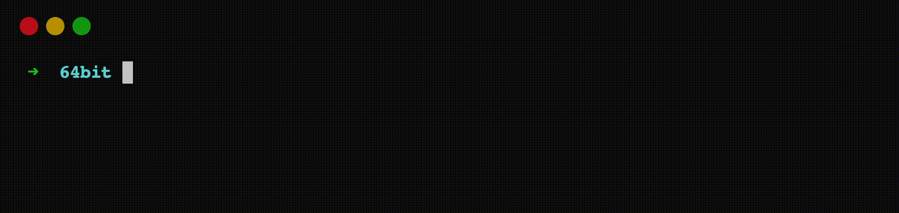

    
    <h3 align="center">upvpn</h3>
    <h4 align="center">A Modern Serverless VPN</h4>
    

# upvpn

upvpn (pronounced Up VPN) app is a WireGuard VPN client for Linux, Windows, Android, tvOS, iOS, and macOS.
For more information please visit https://upvpn.app

upvpn desktop app is made up of UI, CLI and background Daemon.

# Serverless

upvpn utilizes a serverless computing model, where a Linux-based WireGuard server is provisioned on public cloud providers when the app requests a VPN connection. The server is deprovisioned when the app requests to disconnect from the VPN.

This entire process occurs with a single click or tap on the user interface, or through a single command in the terminal.

# Install

- [Linux](https://upvpn.app/downloads/linux)
- [Windows](https://upvpn.app/downloads/windows)
- [macOS](https://upvpn.app/downloads/macos) | [App Store](https://apps.apple.com/app/serverless-vpn-upvpn/id6596774170)
- [iOS | iPadOS | tvOS](https://upvpn.app/downloads/ios) | [App Store](https://apps.apple.com/app/serverless-vpn-upvpn/id6596774170)
- [Android](https://upvpn.app/downloads/android) | [Google Play](https://play.google.com/store/apps/details?id=app.upvpn.upvpn) | [Amazon Appstore](https://www.amazon.com/dp/B0CQ3PNX54) | [Galaxy Store](https://galaxy.store/upvpn) | [APK from Github Releases](https://github.com/upvpn/upvpn-app/releases)

Alternatively, visit [Github Releases](https://github.com/upvpn/upvpn-app/releases) or the website at https://upvpn.app/download

# Code

## Organization

| Crate or Directory | Description |
| --- | --- |
| upvpn-android | Standalone app for Android. |
| upvpn-apple | Standalone apps for tvOS, iOS and macOS built using [Network Extension](https://developer.apple.com/documentation/networkextension). macOS app doesn't include `upvpn` CLI. |
| upvpn-cli | Code for `upvpn` cli. |
| upvpn-config | Configuration read from env vars, `upvpn.conf.toml` are merged at runtime in `upvpn-config` and is source of runtime configuration for `upvpn-cli`, `upvpn-daemon`, and `upvpn-ui`. |
| upvpn-controller | Defines GRPC protobuf for APIs exposed by `upvpn-daemon` to be consumed by `upvpn-cli` and `upvpn-ui`. |
| upvpn-daemon | Daemon is responsible for orchestrating a VPN session. It takes input from upvpn-cli or upvpn-ui via GRPC (defined in `upvpn-controller`) and make calls to backend server via separate GRPC (defined in `upvpn-server`). When backend informs that a server is ready daemon configures network tunnel, see [NetworkDependency.md](./NetworkDependency.md) for more info. |
| upvpn-entity | Defines data models used by upvpn-daemon to persist data on disk in sqlite database. |
| upvpn-migration | Defines database migration from which `upvpn-entity` is generated. |
| upvpn-packages| Contains resources to package binaries for distribution on macOS (pkg), Linux (rpm & deb), and Windows (msi). |
|upvpn-server| Contains GRPC protobuf definitions and code for communication with backend server. |
| upvpn-types | Defines common Rust types for data types used in various crates. These are also used to generate Typescript types for upvpn-ui for seamless serialization and deserialization across language boundaries. |
|upvpn-ui| A Tauri based desktop app. GPRC communication with daemon is done in Rust. Typescript code interact with Rust code via Tauri commands. |

## Building Desktop Apps

Please see [Build.md](./Build.md)

## Building Android App

Please see [upvpn-android/README.md](./upvpn-android/README.md)

## Building iOS, tvOS, macOS Apps

Please see [upvpn-apple/README.md](./upvpn-apple/README.md)

# License

 Android app, apps for Apple Platform, and all Rust crates in this repository are [licensed under GPL version 3](./LICENSE).

Copyright (C) 2023  upvpn LLC

This program is free software: you can redistribute it and/or modify
it under the terms of the GNU General Public License as published by
the Free Software Foundation, either version 3 of the License, or
(at your option) any later version.
